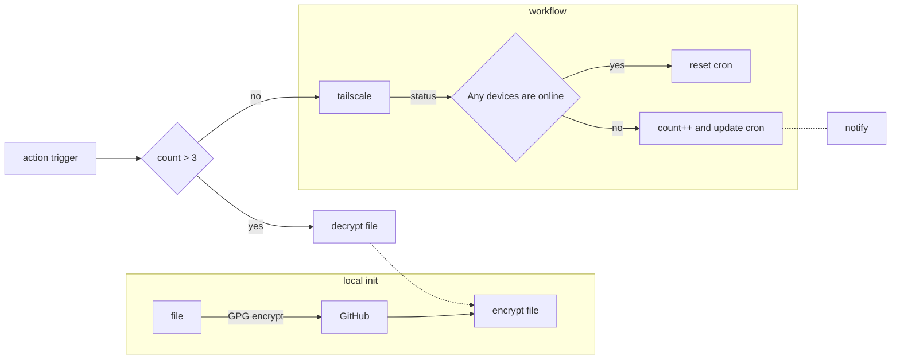

# Death Plan

## Introduction

I was completely unprepared for my friend’s death, and his family and I are at a loss on how to manage his digital
assets. Without knowledge of his passwords or account details, we’re unsure how to access his digital assets, social
media accounts, email, bank, insurance, and investment accounts.
Therefore, I’m writing this to my family and friends to provide guidance on how to handle these matters in the event of
my death.

## Process

