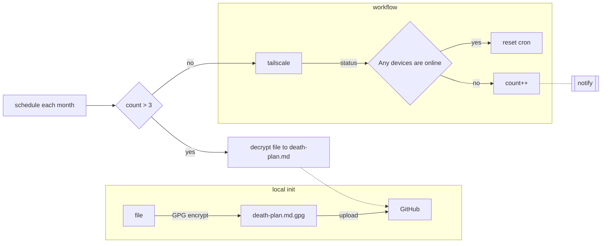

# Death Plan

## Introduction

I was completely unprepared for my [friend](https://github.com/yhc-huichao)'s death. 

Without knowledge of his passwords or account details, we’re unsure how to access his digital assets, social
media accounts, email, enter his phone.

Therefore, I’m writing this tool to remember him, and to help myself and others handle this sad situation.

> Do not go gentle into that good night

## Process

## Variables

- `secrets.WORKFLOW_TOKEN`: need workflow and repo read write access
- `secrets.TS_AUTH_KEY`: tailscale auth key
- `GPG_SIGNING_KEY`: gpg private key base64[^1]
- `GPG_PASSPHRASE`: gpg passphrase

## Projects

- [My blog](https://github.com/bxb100/bxb100.github.io/blob/main/.github/workflows/death-plan.yml)

[^1]: https://stackoverflow.com/questions/61096521/how-to-use-gpg-key-in-github-actions
